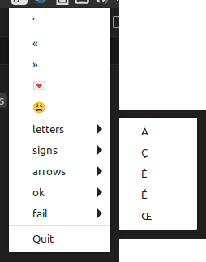

# indicator-chars

Original author: Tobias Schlitt <toby@php.net>
This fork: Cyrille37 <cyrille37@gmail.com>

App indicator to provide a menu with (potentially funny UTF-8) characters for simple copying them to clipboard (similar to original characters applet).

Create a file .indicator-chars in your home directory with lines of characters to be selectable.



## Install

- Checkout source code

- Create ~/.indicator-chars (from `conf-example.indicator-chars` file)
  - Each row corresponds to a set of chars
    - Optional submenu title prefix: `[title]`
    - remove any unused spaces
  - Make sure to use UTF-8 encoding
- Put indicator-chars.py into `auto start`.

## Open issues

- could not find a solution for this error:
```
(indicator-chars.py:14354): Gdk-CRITICAL **: 10:45:20.374:
 gdk_window_thaw_toplevel_updates:
 assertion 'window->update_and_descendants_freeze_count > 0' failed
```

# Changes

Cyrille37's fork:

2025-06-10

- reworked the parser with a single regex
- removed non standard unicode chars
- change readme from RST to Markdown

2021-01-25

  - Python 3 and Gtk 3, tested on Ubuntu 21.10 with MATE desktop
  - `sudo apt-get install gir1.2-appindicator3`

2016-02-03

- Some changes to make indicator-chars works on Ubuntu 12.04LTS with Unity 2D
- replace the custom icon with a theme icon name
- add a char copy into Clipboard(selection="CLIPBOARD")
- use env shebang to find the Python3 engine
- add a configuration file example: "conf-example.indicator-chars"

## Notes

### Unicode / UTF-8

Some non standard chars are present at https://www.amp-what.com/unicode/search/

Some standard sources
- https://unicodeplus.com
- https://unicode-explorer.com

**Caractères originaux**

- La chaîne `s = 'a😞⚠️❓⁉️☠️🌈'` contient des **caractères mal formés** :
  - `😞` est en fait **`U+1F61E`** (Disappointed Face), le code l'interprète comme `U+1F61E` (ce qui est correct).
  - `⚠️` est en réalité **`U+26A0` (⚠) + `U+FE0F` (Variation Selector-16)**, ce qui n'est pas un emoji standard. Cela explique la présence de `U+FE0F` (VS16).
  - `❓` est **`U+2753`** (Black Question Mark Ornament), le code l'interprète comme `U+2753` (correct).
  - `⁉️` est **`U+2049` (Exclamation Question Mark) + `U+FE0F`** (VS16), ce qui n'est pas un emoji standard.
  - `☠️` est **`U+2620` (Skull and Bones) + `U+FE0F`** (VS16).
  - `🌈` est **`U+1F308`** (Rainbow), correct.

**Nettoyage et normalisation**

- Le nettoyage élimine les caractères de contrôle (comme `U+FE0F`), mais `U+FE0F` n'est pas une **catégorie Cc** (contrôle), il est de catégorie **Me** (Mark, Enclosing) ou **Sk** (Symbol, Modifier). Ainsi, il n'est **pas supprimé** par le nettoyage.
- La normalisation `NFKC` ne supprime pas `U+FE0F`.

**Résultat final**

- La chaîne contient des **caractères non standard** comme `U+FE0F` (VS16).

**Solution**

Pour corriger le problème, vous devez :
1. **Utiliser des emojis standard** (sans VS16).
2. **Éviter les combinaisons non standard**.
